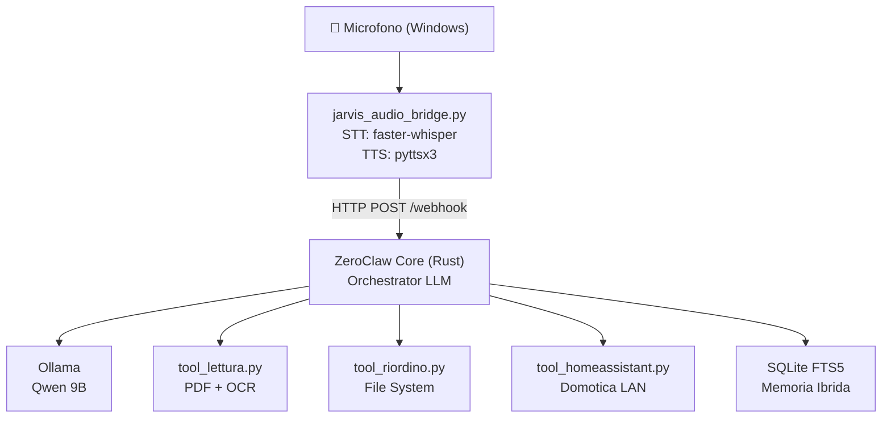

# 🤖 Analisi Progetto JARVIS — Report Dettagliato

## Panoramica Architettura

Il progetto è un assistente vocale personale **100% locale** costruito su questi strati:



**Stack chiave:**
| Layer | Tecnologia | Note |
|---|---|---|
| STT | `faster-whisper` (modello `base`) | CPU, int8 quant |
| Orchestratore | ZeroClaw (Rust) | Port 42617, daemon mode |
| LLM | Qwen 9B via Ollama | Su WSL, RTX 5070 |
| TTS | `pyttsx3` (SAPI5) | Voce italiana |
| Memoria | SQLite + FTS5 | Locale, 30gg retention |
| Domotica | Home Assistant API (LAN) | Opzionale |

---

## ✅ Punti di Forza

### 1. Privacy-First by Design
La scelta di ZeroClaw come orchestratore Rust + Ollama locale è eccellente. Zero dati verso cloud. Il check [is_local_network()](file:///c:/Users/Nuno/Documents/programmazione/11_JARVIS_project/jarvis_local/tools/tool_homeassistant.py#15-21) nel tool Home Assistant dimostra sensibilità alla sicurezza.

### 2. Sandboxing e Human-in-the-Loop
[tool_riordino.py](file:///c:/Users/Nuno/Documents/programmazione/11_JARVIS_project/jarvis_local/tools/tool_riordino.py) implementa correttamente tre livelli di difesa:
1. **Path sandboxing** → solo `Jarvis_Drop/`
2. **Preview** delle operazioni prima dell'esecuzione
3. **Conferma interattiva** → [human_verification()](file:///c:/Users/Nuno/Documents/programmazione/11_JARVIS_project/jarvis_local/tools/tool_riordino.py#27-40)

Questo pattern è da replicare su *tutti* i tool.

### 3. Separazione delle Responsabilità (POC → Produzione)
La cartella `poc/` contiene esperimenti puliti e separati. La transizione verso [jarvis_audio_bridge.py](file:///c:/Users/Nuno/Documents/programmazione/11_JARVIS_project/jarvis_local/jarvis_audio_bridge.py) + ZeroClaw è ben strutturata.

### 4. Config-Driven Architecture
Personalità ([SOUL.md](file:///c:/Users/Nuno/Documents/programmazione/11_JARVIS_project/jarvis_local/.zeroclaw/workspace/SOUL.md)), routing agenti ([AGENTS.md](file:///c:/Users/Nuno/Documents/programmazione/11_JARVIS_project/jarvis_local/.zeroclaw/workspace/AGENTS.md)) e parametri ([config.toml](file:///c:/Users/Nuno/Documents/programmazione/11_JARVIS_project/jarvis_local/.zeroclaw/workspace/config.toml)) sono separati dal codice → facile da customizzare senza toccare Python.

---

## ⚠️ Criticità e Aree di Miglioramento

### 🔴 ALTA PRIORITÀ

#### 1. Secret hardcoded in [jarvis_audio_bridge.py](file:///c:/Users/Nuno/Documents/programmazione/11_JARVIS_project/jarvis_local/jarvis_audio_bridge.py) (riga 16)
```python
# PROBLEMA
SECRET = "jarvis_internal_secret"  # Leak in git history!
```
```python
# SOLUZIONE
import os
from dotenv import load_dotenv
load_dotenv()
SECRET = os.getenv("ZEROCLAW_SECRET")
```
Il [.env](file:///c:/Users/Nuno/Documents/programmazione/11_JARVIS_project/jarvis_local/.env) esiste già nella root ma non viene usato dal bridge. Il secret è anche in chiaro nel [config.toml](file:///c:/Users/Nuno/Documents/programmazione/11_JARVIS_project/jarvis_local/.zeroclaw/workspace/config.toml) tracciato da git.

> [!CAUTION]
> Se il repo finisce su GitHub, il secret è esposto. Aggiungere [.env](file:///c:/Users/Nuno/Documents/programmazione/11_JARVIS_project/jarvis_local/.env) e [.zeroclaw/workspace/.secret_key](file:///c:/Users/Nuno/Documents/programmazione/11_JARVIS_project/jarvis_local/.zeroclaw/workspace/.secret_key) al `.gitignore`.

#### 2. Nessun `.gitignore`
Il file [.env](file:///c:/Users/Nuno/Documents/programmazione/11_JARVIS_project/jarvis_local/.env), [.zeroclaw/workspace/.secret_key](file:///c:/Users/Nuno/Documents/programmazione/11_JARVIS_project/jarvis_local/.zeroclaw/workspace/.secret_key) e `logs/` non sono protetti. Un `push` accidentale espone credenziali.

#### 3. VAD Artigianale fragile ([listen_loop](file:///c:/Users/Nuno/Documents/programmazione/11_JARVIS_project/jarvis_local/jarvis_audio_bridge.py#55-102))
```python
# Threshold fisso → problemi con ambienti rumorosi o silenziosi
if rms > 0.01:
```
Con microfoni diversi o ambienti rumorosi il threshold `0.01` può essere troppo basso (falsi positivi) o troppo alto (taglia il parlato). Manca calibrazione adattiva.

**Soluzione**: usare `webrtcvad` (Google VAD) o il VAD built-in di `faster-whisper` (già usato in [poc_listen.py](file:///c:/Users/Nuno/Documents/programmazione/11_JARVIS_project/jarvis_local/poc/poc_listen.py) con `vad_filter=True`).

#### 4. TTS bloccante — l'assistente non può ascoltare mentre parla
`pyttsx3` + `engine.runAndWait()` blocca il thread principale. Significa che durante la risposta TTS, qualsiasi parlato viene perso.

```python
# SOLUZIONE: TTS in thread separato + lock per prevenire ascolto durante parlato
def speak(text):
    stop_listening.set()  # Segnale al listener di pausare
    engine.say(text)
    engine.runAndWait()
    stop_listening.clear()
```
Oppure migrazione a **Piper TTS** (il modello [.onnx](file:///c:/Users/Nuno/Documents/programmazione/11_JARVIS_project/jarvis_local/it_IT-paola-medium.onnx) c'è già nella root ma non viene usato!).

#### 5. Il modello Piper [.onnx](file:///c:/Users/Nuno/Documents/programmazione/11_JARVIS_project/jarvis_local/it_IT-paola-medium.onnx) è presente ma non integrato
```
it_IT-paola-medium.onnx          # 63MB — già scaricato!
it_IT-paola-medium.onnx.json
```
Questo modello TTS è **superiore** a pyttsx3/SAPI5 (voce molto più naturale) e funziona offline. È nella root ma non viene chiamato da nessuna parte. Spreco significativo.

---

### 🟡 MEDIA PRIORITÀ

#### 6. Nessun sistema di logging strutturato
Il progetto usa `print()` ovunque. La cartella `logs/` esiste ma non viene scritta. Con un sistema H24, diagnosticare errori diventa impossibile.

```python
# SOLUZIONE: logging stdlib Python
import logging
logging.basicConfig(
    level=logging.INFO,
    format="%(asctime)s [%(levelname)s] %(message)s",
    handlers=[
        logging.FileHandler("logs/jarvis.log"),
        logging.StreamHandler()
    ]
)
```

#### 7. Wake word assente — sempre in ascolto
Il bridge ascolta **continuamente** senza wake word ("Jarvis, ..."). Questo:
- Consuma CPU H24 (Whisper ogni 2-3 secondi)
- Rischia falsi trigger da audio ambiente
- Spreca le trascrizioni di audio non intenzionale

**Soluzione breve termine**: filtrare le trascrizioni corte (`len(text) < 3`) e aggiungere un check sulla keyword "jarvis" come primo token.
**Soluzione ideale**: `openwakeword` (leggero, locale, già usato dalla community Whisper).

#### 8. Webhook ZeroClaw sulla porta 8080 ma bridge su 42617
Nel [config.toml](file:///c:/Users/Nuno/Documents/programmazione/11_JARVIS_project/jarvis_local/.zeroclaw/workspace/config.toml):
- `[channels_config.webhook] port = 8080`
- `[gateway] port = 42617`

Il bridge usa `42617`. La documentazione dice che ZeroClaw espone anche il webhook su `8080`. Confusione potenziale tra gate e webhook se si aggiungono altri client.

#### 9. `max_actions_per_hour = 20` — troppo basso per uso normale
```toml
max_actions_per_hour = 20
```
Se Jarvis viene usato in una sessione attiva di 30 minuti con 1 domanda/min = 30 azioni → blocco. Aumentare o rendere configurabile.

#### 10. `embedding_provider = "none"` → memoria vettoriale disabilitata
```toml
embedding_provider = "none"
```
La memoria long-term di ZeroClaw è configurata con SQLite FTS5 (keyword search), ma gli **embedding vettoriali sono disabilitati**. Questo significa che la ricerca semantica sui ricordi non funziona — solo keyword match.

**Soluzione**: abilitare con Ollama stesso (es. `nomic-embed-text`, modello leggero).

---

### 🟢 BASSA PRIORITÀ / FUTURI MIGLIORAMENTI

#### 11. [poc/jarvis_core.py](file:///c:/Users/Nuno/Documents/programmazione/11_JARVIS_project/jarvis_local/poc/jarvis_core.py) usa recording a tempo fisso (5s)
```python
DURATION = 5  # registra esattamente 5 secondi
```
Sostituito correttamente nel bridge dal VAD + silence detection. Il POC può essere archiviato.

#### 12. Tool Email mancante  
Dalle conversazioni precedenti era pianificato un tool email (Yahoo/Gmail). Non ancora implementato nella cartella `tools/`.

#### 13. Nessun frontend grafico
Il progetto gira solo da console. Un frontend Electron minimalista (pianificato nelle conversazioni precedenti) migliorebbe l'usabilità e permetterebbe log visivi real-time.

#### 14. Test coverage quasi zero
Esistono [test_security.py](file:///c:/Users/Nuno/Documents/programmazione/11_JARVIS_project/jarvis_local/test_security.py) e [test_tts.py](file:///c:/Users/Nuno/Documents/programmazione/11_JARVIS_project/jarvis_local/test_tts.py) nella root, ma sono file molto basilari. Nessun test per i tool critici ([tool_riordino.py](file:///c:/Users/Nuno/Documents/programmazione/11_JARVIS_project/jarvis_local/tools/tool_riordino.py) che muove file!).

---

## 🗺️ Roadmap Prioritizzata

```
Immediato (1-2 ore):
[1] Creare .gitignore (proteggere .env, .secret_key, logs/, venv/)
[2] Spostare SECRET da codice a .env sul bridge
[3] Integrare Piper TTS (modello già scaricato!)

Breve termine (giorni):
[4] Sostituire VAD artigianale con faster-whisper vad_filter
[5] Aggiungere TTS asincrono con lock ascolto
[6] Aggiungere logging su file (logs/)
[7] Implementare filtro wake-word ("jarvis, ...")

Medio termine (settimane):
[8] Abilitare embedding con nomic-embed-text (memoria semantica)
[9] Implementare tool_email.py
[10] Frontend Electron minimale con log real-time
[11] Test unitari per tool_riordino.py e tool_homeassistant.py
```

---

## 📊 Valutazione Complessiva

| Area | Voto | Note |
|---|---|---|
| Architettura generale | 8/10 | Scelte solide, privacy-first |
| Sicurezza | 6/10 | Buone idee ma secret hardcoded |
| Qualità del codice | 7/10 | Pulito, commentato, da strutturare |
| Audio pipeline | 5/10 | VAD fragile, Piper non integrato |
| Memoria/Contesto | 6/10 | Embedding disabilitato |
| Test coverage | 3/10 | Quasi assente |
| **Media** | **6/10** | Ottima base, da rifinire |

> [!NOTE]
> Il progetto ha una solidissima base architetturale. Le criticità sono tutte **risolvibili in poco tempo** e non richiedono redesign. Il gap più grande è tra il **potenziale dichiarato** (Piper TTS già scaricato, embedding configurati, daemon ZeroClaw) e l'**integrazione effettiva** di queste componenti.
